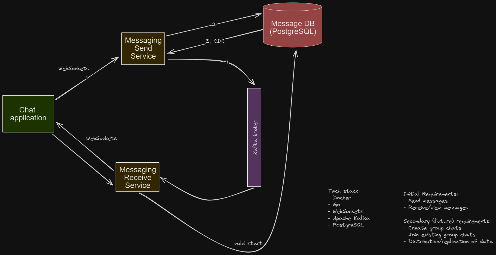

# messaging-app

A side project to learn Go & PostgreSQL. This is a messaging application (Facebook/Telegram clone) with minimal UI. 

Uses WebSockets to communicate with two send/receive message services, who are publishers/subscribers, respectively to a Kafka broker. Persists messaging data to a PostgreSQL instance.

